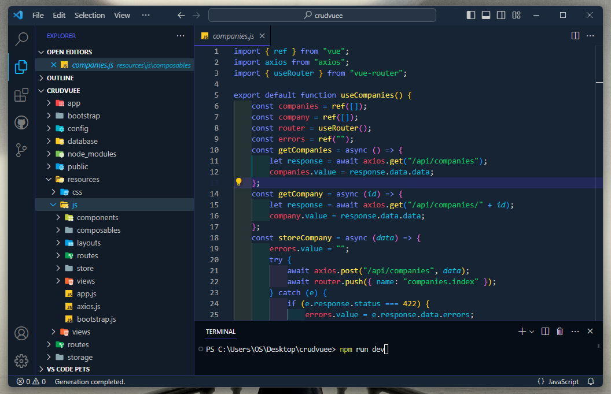
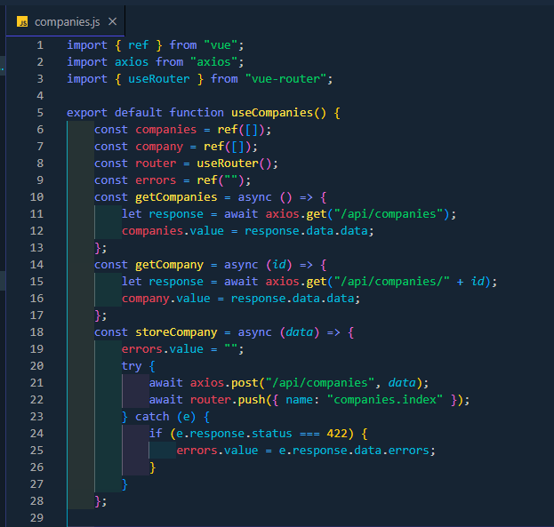
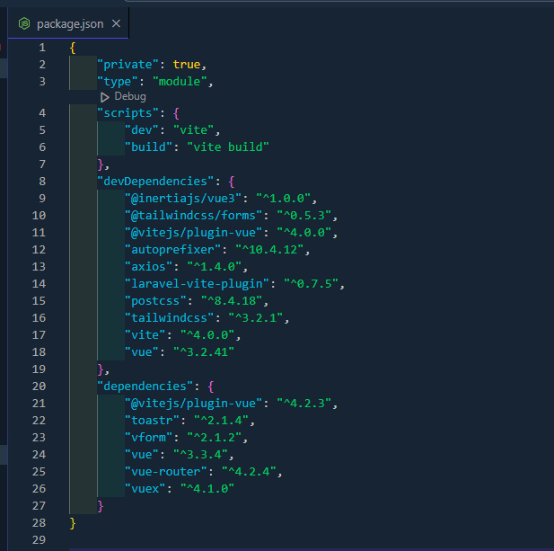
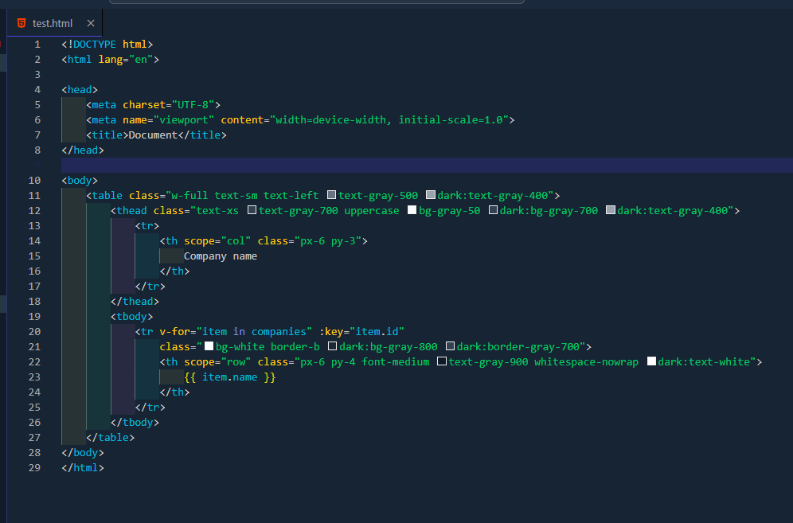
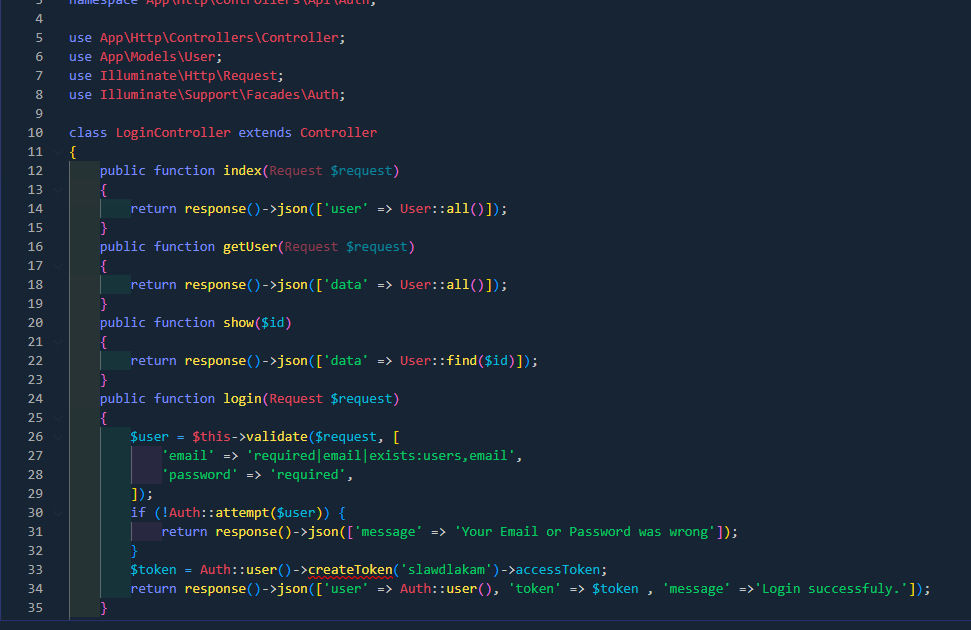

# Stella Darknight - Visual Studio Code Theme

Stella Darknight is a dark-themed, highly customizable Visual Studio Code theme designed to provide a comfortable and stylish coding environment. With a focus on readability and aesthetics, Stella Darknight is perfect for those who prefer to code in the dark.

## Installation

To install Stella Darknight, follow these simple steps:

1. Open **Visual Studio Code**.
2. Go to the **Extensions** view by clicking on the square icon in the sidebar or using `Ctrl+Shift+X`.
3. Search for `Stella Darknight`.
4. Click **Install** to install the theme.
5. Once installed, select **Stella Darknight** as your active color theme by going to `File > Preferences > Color Theme` or pressing `Ctrl+K Ctrl+T`.

## Preview

Here are some previews of Stella Darknight for different programming languages:

- 
- 
- 
- 

Enjoy coding with Stella Darknight, and happy coding!

