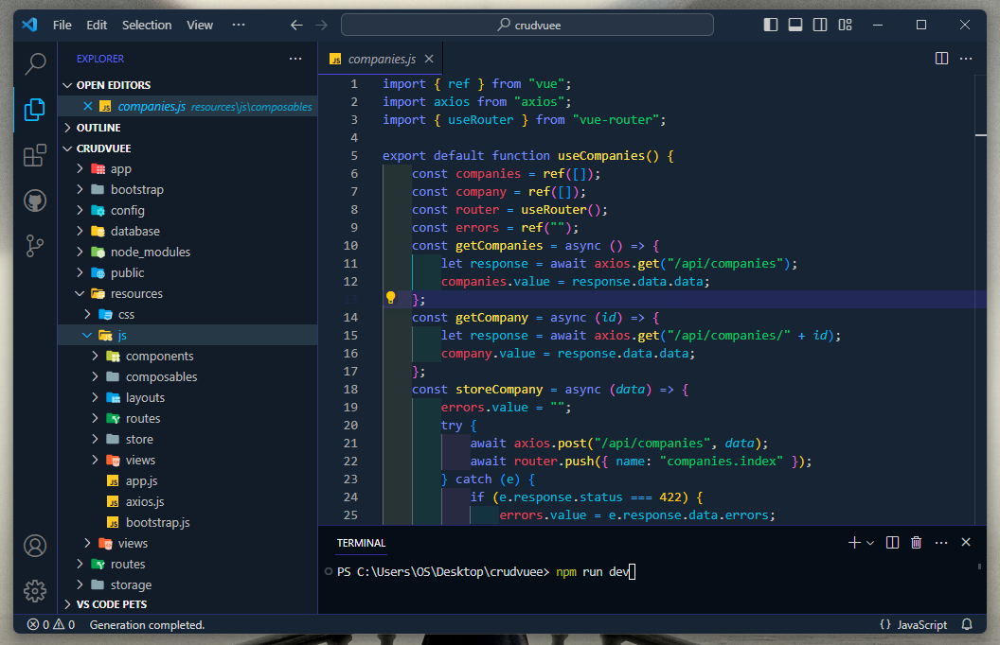
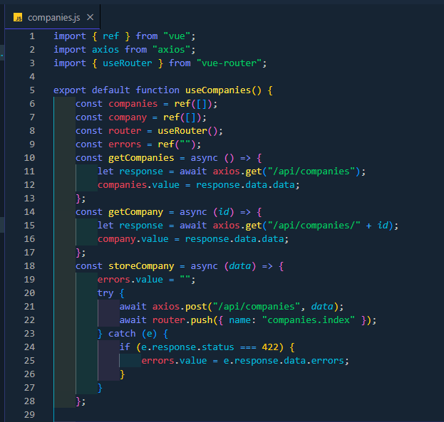
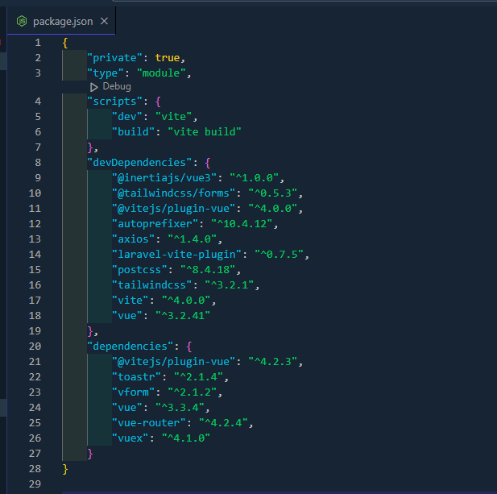
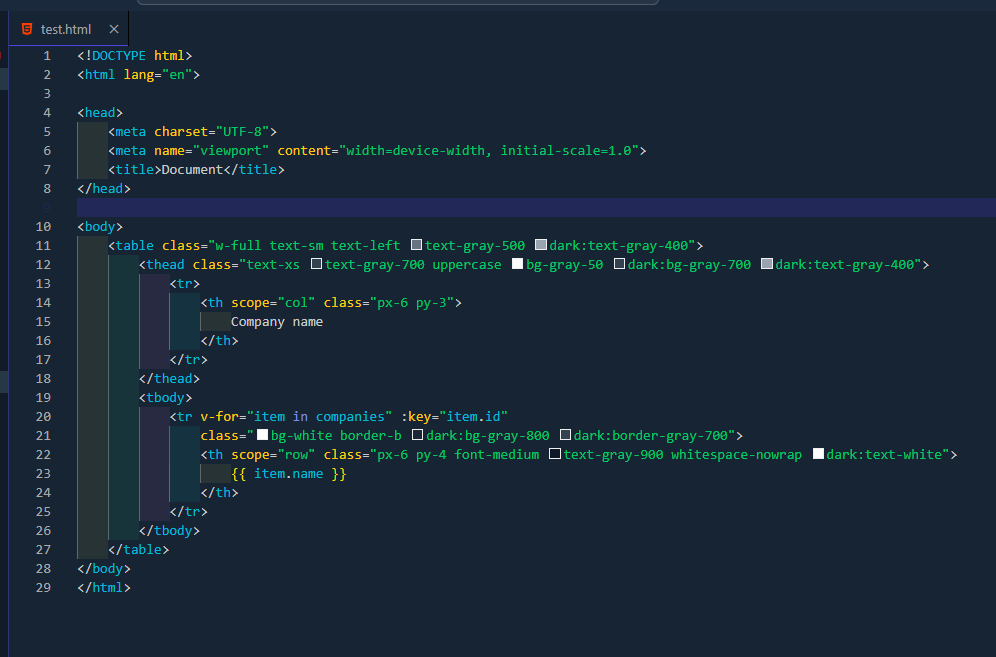
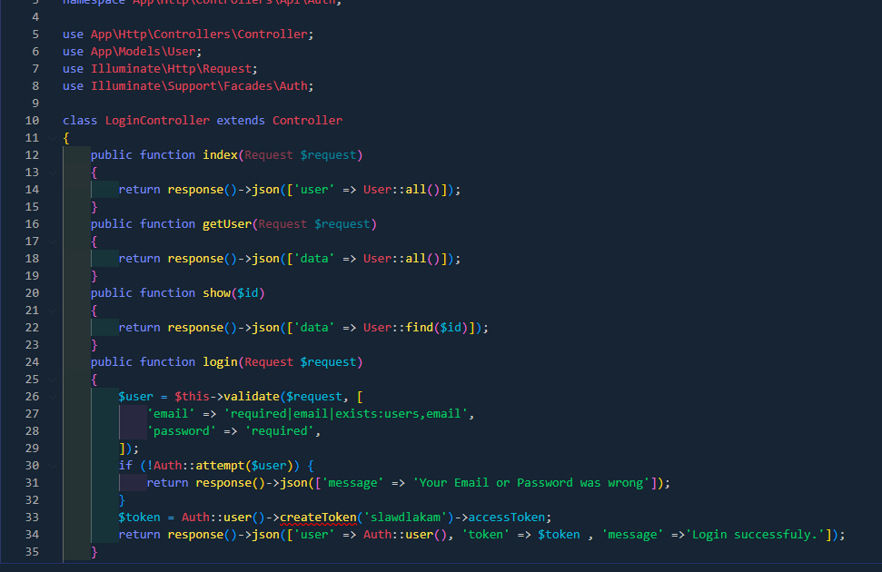
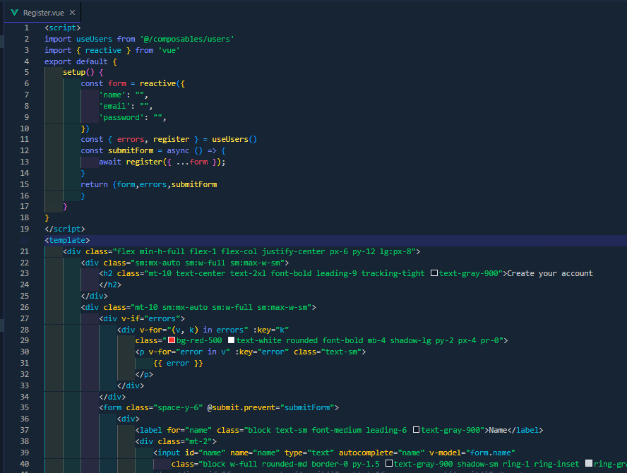

# Stella Darknight - Visual Studio Code Theme

Stella Darknight is a dark-themed, highly customizable Visual Studio Code theme designed to provide a comfortable and stylish coding environment. With a focus on readability and aesthetics, Stella Darknight is perfect for those who prefer to code in the dark.

## Installation

To install Stella Darknight, follow these simple steps:

1. Open **Visual Studio Code**.
2. Go to the **Extensions** view by clicking on the square icon in the sidebar or using `Ctrl+Shift+X`.
3. Search for `Stella Darknight`.
4. Click **Install** to install the theme.
5. Once installed, select **Stella Darknight** as your active color theme by going to `File > Preferences > Color Theme` or pressing `Ctrl+K Ctrl+T`.

## Preview

Here are some previews of Stella Darknight for different programming languages:

- JavaScript
  
- JSON
  
- HTML
  
- PHP
  
- Vue
  

## Enjoying Stella Darknight?

If you're finding Stella Darknight helpful and enjoy using it, please consider taking a moment to support the project:

1. **Install the Theme:** If you haven't already, install Stella Darknight by following the installation instructions above.

2. **Leave a Review:** Your feedback is valuable! Please leave a review in the Visual Studio Code Marketplace with your thoughts and star rating. Your reviews help others discover and trust Stella Darknight.

3. **Spread the Word:** If you love Stella Darknight, consider sharing it with your friends and colleagues. The more people who benefit from this theme, the better it becomes.

Thank you for your support and enjoy coding with Stella Darknight!
